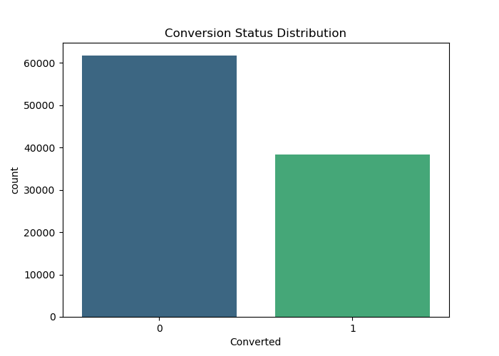
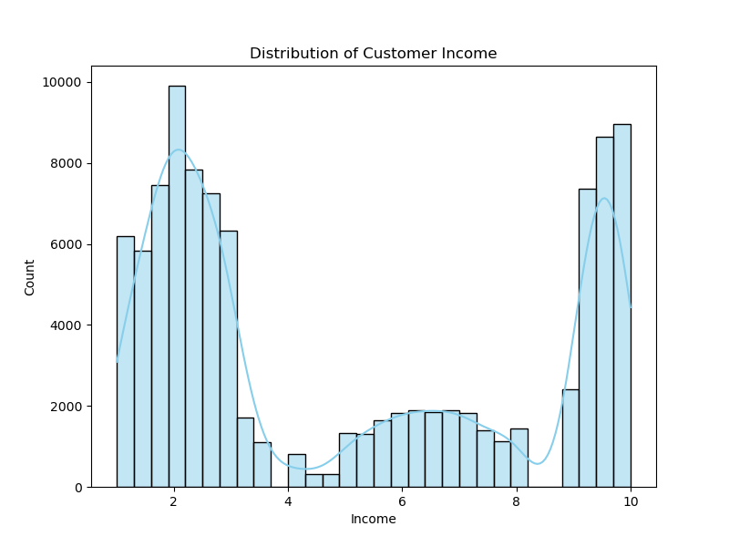
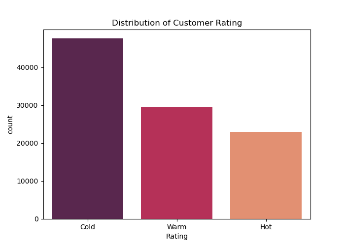
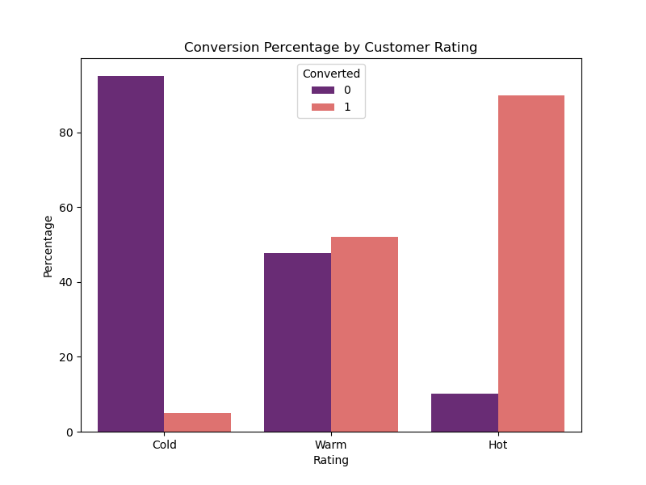
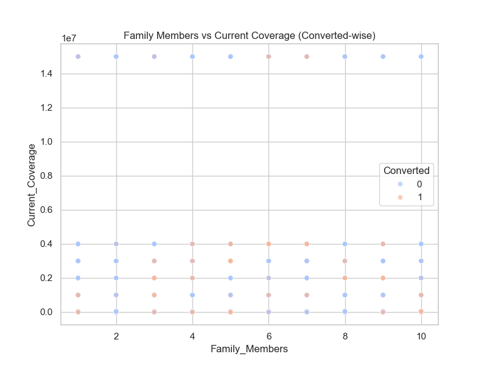
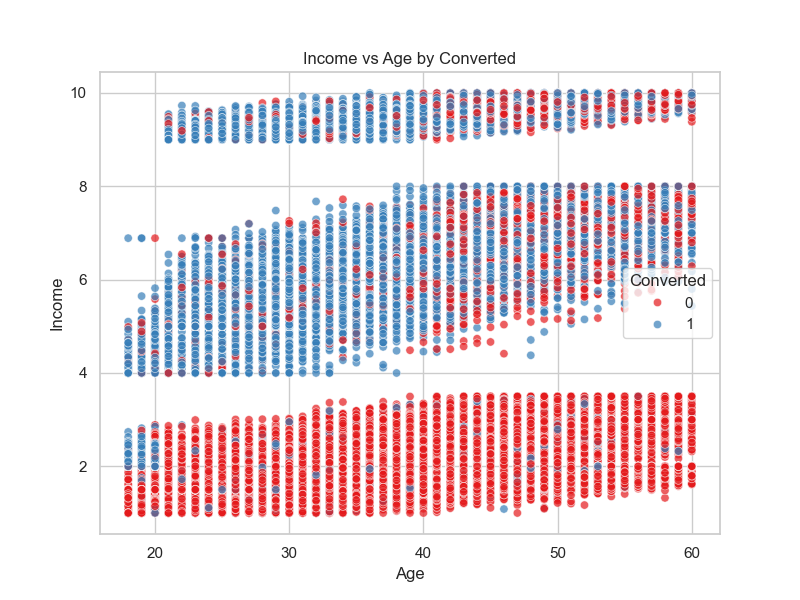
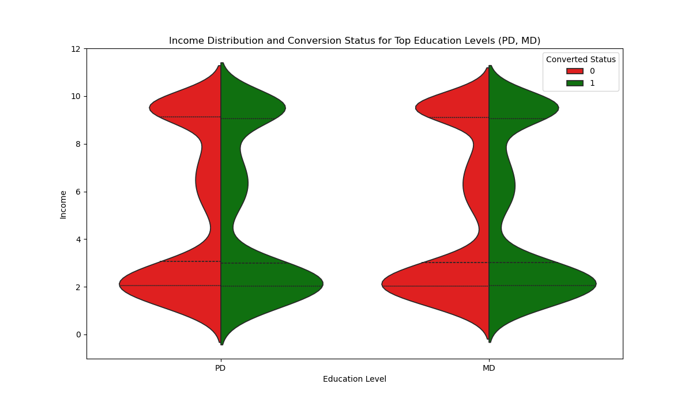
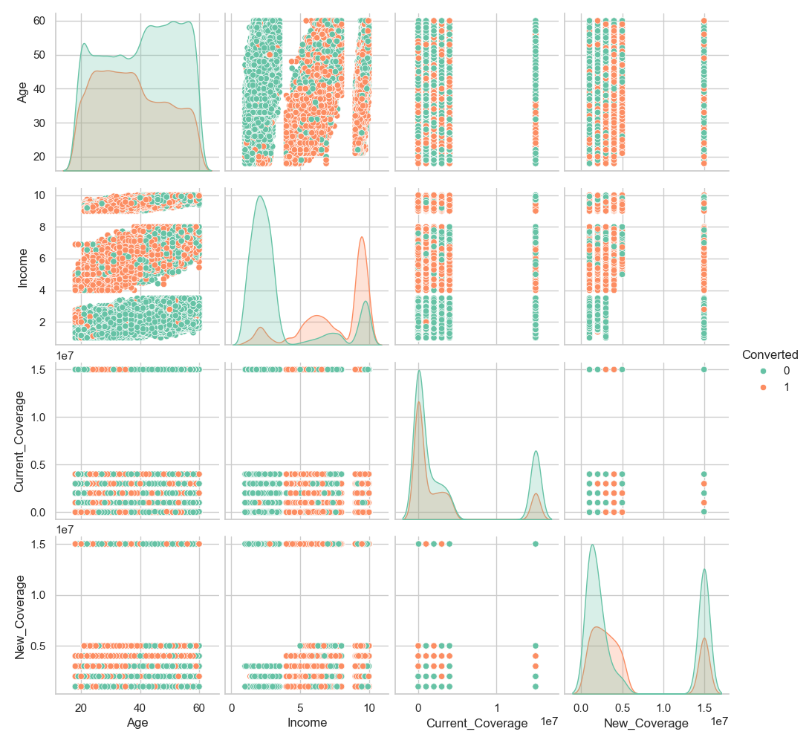

# Cross-Selling Analysis – United India Insurance Company (UIIC)

This is a Data Analytics Project aimed at understanding and improving cross-selling strategies for United India Insurance Company (UIIC).
The project analyzes customer demographic, financial, and product coverage information to uncover insights that support targeted marketing.

## Project Objective

To analyze UIIC customer data and identify:

Which customer groups are most likely to purchase a new insurance product

Patterns in current vs. new coverage

Customer behavior across age, family size, occupation, education, and income

Insights that support data-driven cross-selling decisions


## Project Structure
```
uiic-cross-selling-project/
│
├── notebooks/
│     └── INS_Report.ipynb
│
├── reports/
│     ├── Business Understanding.pdf
│     ├── UIIC-Report.pdf
│     ├── Data Engineering Strategy.pdf
│     ├── Data Engineering Strategy - Copy.pdf
│     └── my_report.html
│
├── data/
│     ├── raw/
│     └── processed/
│
├── images/
│     ├── converted_distribution.png
│     ├── income_distribution.png
│     ├── rating_distribution.png
│     ├── rating_conversion.png
│     ├── family_vs_current.png
│     ├── income_vs_age.png
│     ├── income_education_violin.png
│     └── pairwise_relationships.png
│
├── README.md
├── requirements.txt
└── .gitignore
```


## Data Understanding

The dataset contains 100,000 customer records with fields such as:

Age

Gender

Marital Status

Family Members

Education

Occupation

Job Title

Income

Current Product Type

Current Coverage

New Product Type

New Coverage

Rating

Converted (Target variable)

A YData Profiling Report was generated to explore dataset quality, distributions, correlations, and potential issues.

## Data Cleaning Approach

Data cleaning was done using UIIC-defined business rules:

✔ Age

Filled using min(mean, median) to keep values stable.

✔ Family Members

Filled using median due to skewed family sizes.

✔ Education, Occupation, Job Title

Filled using mode because these are categorical.

✔ Current Product & Type

Derived using rules:

If current coverage = 0 → no current product

If product type = "NA" → assign “No Product”

✔ New Product Type & Coverage

Filled using median/mode based on group patterns.

## Feature Engineering

The following engineered fields support deeper analysis:

✔ Current Product Flag

Shows whether a customer currently holds a policy.

✔ New Coverage Group

Segments customers based on new policy amounts.

✔ Coverage Gap

Difference between new and current coverage.

These help segment customers into meaningful groups for insights.

## 📈Exploratory Data Analysis (EDA)

EDA covers:

Age distribution

Income patterns

Family size segments

Product coverage gaps

Rating distribution

Conversion behavior

Crosstab analysis (gender × marital status)

Pairwise relationships

Charts used:

Histogram

Bar plot

KDE plot

Scatter plot

Violin plot

Heatmaps

Pair-plot

## Visual Insights

### Conversion Status Distribution


### Income Distribution


### Customer Rating Distribution


### Conversion % by Rating


### Family Members vs Current Coverage


### Income vs Age by Converted


### Income Distribution by Education (Violin Plot)


### Pairwise Relationships Among Key Variables



## Key Insights
1. Pairwise Patterns\

    * Younger, moderate-income customers show highest conversions

    * Older, high-income customers rarely convert

    * Customers with low current coverage + mid income buy new products more

Business Insight:
### Focus marketing on young-to-mid-age, mid-income groups with low-to-moderate coverage.

2. Income vs Age

    * Ages 25–40 with ₹4L–₹10L income convert well

    * Older, wealthier customers need personalized advisory

3. Family Size Patterns

    * Customers with 3–5 dependents + low coverage show interest in upgrades

    * Smaller families with high coverage show low interest

4. Rating-Based Behavior

    * Hot & Warm customers convert more

    
    * Cold customers need trust-building before cross-sell

## Overall Business Recommendations

1. Target young, mid-income customers for cross-selling

2. Build family-focused bundle plans (life + health)

3. Prioritize warm/hot-rated customers for premium policies

4. Customize messaging based on education and occupation

5. Increase digital engagement for younger audiences (app notifications, SMS campaigns)

## How to Run This Project
1️. Install required libraries
    * pip install -r requirements.txt

2️. Open Jupyter Notebook
    * jupyter notebook

3️. Run notebook
    * notebooks/INS_Report.ipynb

## Requirements
. pandas

. numpy


. seaborn

. ydata-profiling

. jupyter
